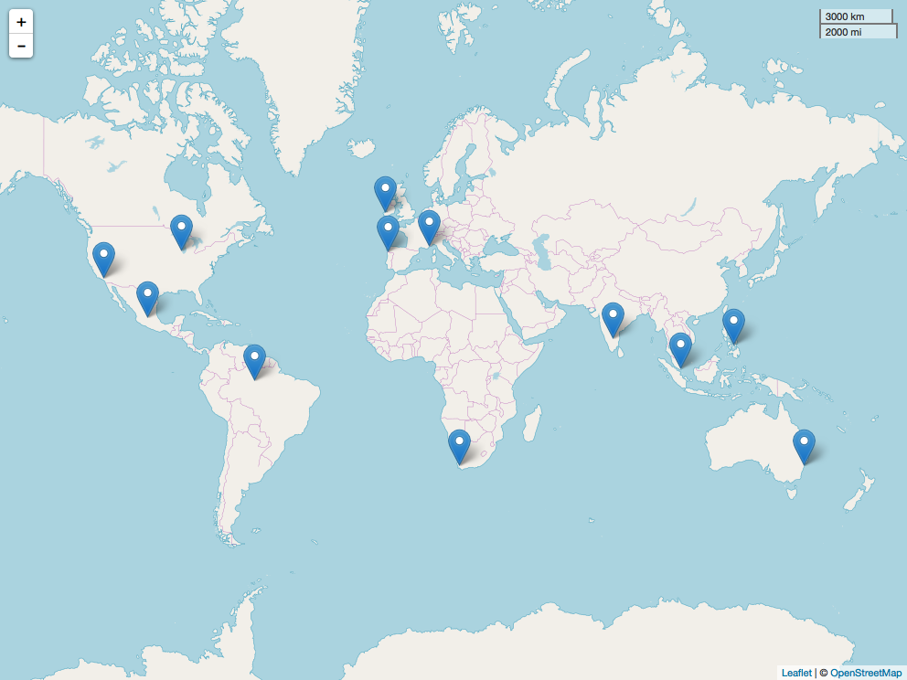
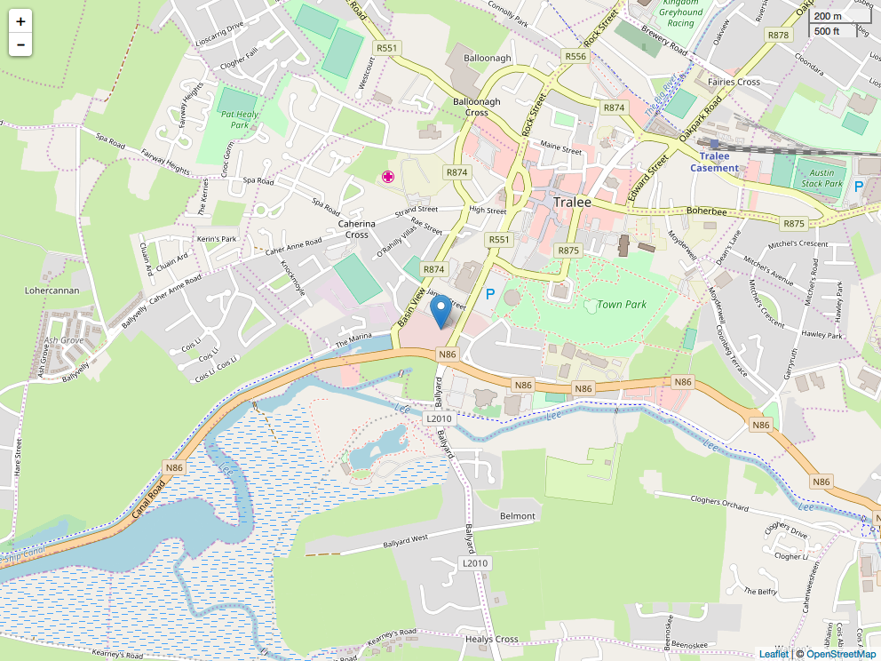

-2018-05-07.png){ width=50% }

-2018-05-07.png){ width=50% }

-2018-05-07.png){ width=50% }

-2018-05-07.png){ width=50% }

-2018-05-07.png){ width=50% }

-2018-05-07.png){ width=50% }

-2018-05-07.png){ width=50% }

{ width=50% }

-2018-05-07.png){ width=50% }

-2018-05-07.png){ width=50% }

-2018-05-07.png){ width=50% }

-2018-05-07.png){ width=50% }

-2018-05-07.png){ width=50% }

-2018-05-07.png){ width=50% }

-2018-05-07.png){ width=50% }

-2018-05-07.png){ width=50% }

-2018-05-07.png){ width=50% }

-2018-05-07.png){ width=50% }

-2018-05-07.png){ width=50% }

-2018-05-07.png){ width=50% }

-2018-05-07.png){ width=50% }

-2018-05-07.png){ width=50% }

-2018-05-07.png){ width=50% }

-2018-05-07.png){ width=50% }

-2018-05-07.png){ width=50% }

-2018-05-07.png){ width=50% }

-2018-05-07.png){ width=50% }

-2018-05-07.png){ width=50% }

-2018-05-07.png){ width=50% }

-2018-05-07.png){ width=50% }

-2018-05-07.png){ width=50% }

{ width=50% }

-2018-05-07.png){ width=50% }

-2018-05-07.png){ width=50% }

-2018-05-07.png){ width=50% }

-2018-05-07.png){ width=50% }

-2018-05-07.png){ width=50% }

-2018-05-07.png){ width=50% }

-2018-05-07.png){ width=50% }

-2018-05-07.png){ width=50% }

-2018-05-07.png){ width=50% }

-2018-05-07.png){ width=50% }

-2018-05-07.png){ width=50% }

-2018-05-07.png){ width=50% }

-2018-05-07.png){ width=50% }

-2018-05-07.png){ width=50% }

-2018-05-07.png){ width=50% }

-2018-05-07.png){ width=50% }

-2018-05-07.png){ width=50% }

-2018-05-07.png){ width=50% }

-2018-05-07.png){ width=50% }

-2018-05-07.png){ width=50% }

-2018-05-07.png){ width=50% }

-2018-05-07.png){ width=50% }

-2018-05-07.png){ width=50% }

-2018-05-07.png){ width=50% }

-2018-05-07.png){ width=50% }

